# Support Vector Machines

This note is the model-family reference for support vector machines (SVMs) in the Telco Customer Churn project. It is written as a technical learning note before the SVM notebook is built. The goal is to understand the maximum-margin idea slowly and carefully, then connect it to hinge loss, kernels, scikit-learn implementations, and the development-stage evaluation discipline used throughout the project.

The note follows the same modelling discipline as the rest of the project:

```text
training data only for model development;
held-out test data remains untouched;
fixed transparent grids at this educational stage;
small cross-validation differences are not overclaimed;
thresholds, calibration, and final test evaluation are deferred.
```

SVMs are a useful next model family after logistic regression, kNN, Naive Bayes, decision trees, bagging, random forests, and boosting because they connect several ideas that already appeared earlier:

- Like logistic regression, an SVM can be a linear classifier based on a score $f(x)=w^\top x+b$.
- Like kNN and RBF kernels, SVMs depend strongly on geometry, distances, and feature scale.
- Like feature expansion, kernels allow linear models in transformed feature spaces to create nonlinear decision boundaries in the original feature space.
- Like regularized logistic regression, SVMs use a regularization parameter to control the bias-variance tradeoff.
- Like ranking models, SVMs naturally produce a decision score that can be used for ROC-AUC and PR-AUC before turning that score into calibrated probabilities.

The central conceptual shift is this:

> A classifier should not merely separate the training data if separation is possible. It should separate the classes with a large margin.

---

## 1. From logistic regression to the maximum-margin problem

Logistic regression fits a linear score and converts it into a probability through a sigmoid. With regularization, it is a strong and stable baseline. However, in a very well-separated dataset, there may be many separating linear boundaries that classify the training observations correctly. If the main objective is just to make the training labels correct, then many quite different separators can look equally good.

The course material motivates maximum-margin classification from exactly this issue: logistic regression can separate well-separated data, but if there are several separators that classify the training data almost perfectly, we still need a principle for choosing one of them.

<p align="center">
  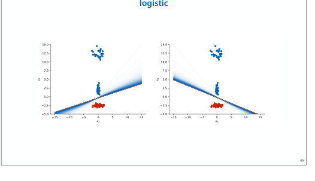
</p>

A boundary that barely separates the classes can be fragile. A new observation very close to an existing training point may end up on the other side of the boundary and receive a different class. That is not the intuitive behaviour we want from a classifier: nearby points in feature space should usually receive similar predictions, unless the data strongly suggest otherwise.

<p align="center">
  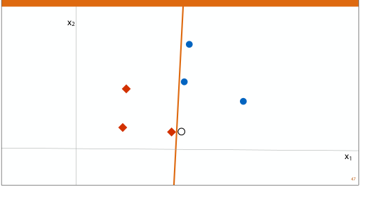
</p>

This motivates a geometric question:

> Among all separating hyperplanes, which one leaves the largest possible empty band between the two classes?

That question gives the maximum-margin classifier.

---

## 2. The maximum-margin separator before formulas

Before introducing the algebra, it helps to keep the geometric picture clear.

We want a hyperplane that separates the positive and negative classes and is far from the closest points on both sides. The distance is not measured along one coordinate axis. It is measured at a right angle to the boundary, because the shortest distance from a point to a line or hyperplane is perpendicular.

<p align="center">
  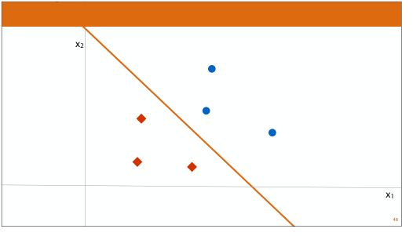
</p>

The **margin** is the distance between the decision boundary and the closest training observations. A maximum-margin classifier chooses the separating boundary whose margin is as large as possible.

<p align="center">
  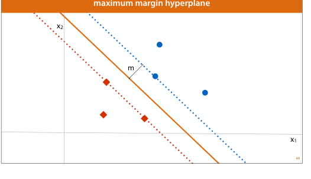
</p>

The closest observations are special. They are the observations that determine how far the boundary can move before it would collide with the training data. These closest observations are called **support vectors**.

<p align="center">
  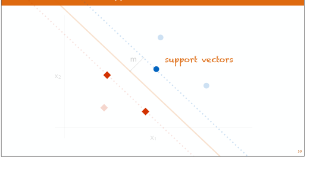
</p>

The name is literal: the support vectors support, or hold in place, the maximum-margin boundary. If only the support vectors were given, the maximum-margin separator could still be recovered. Points far away from the margin are correctly classified with comfortable room and do not directly determine the hard-margin solution.

This is very different from ordinary least-squares regression and also different from the usual logistic-regression intuition. In least squares, every residual contributes continuously to the objective. In a hard-margin SVM, the observations far from the margin are already safe. The boundary is determined by the critical observations closest to the decision boundary.

---

## 3. Names for the same family of ideas

The course material explicitly groups several names together:

<p align="center">
  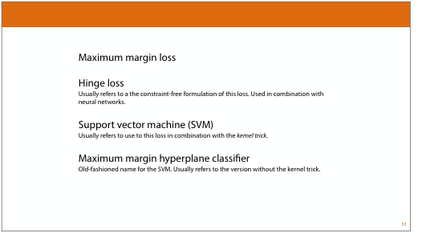
</p>

These terms are not unrelated. They are different perspectives on the same maximum-margin family.

**Maximum-margin hyperplane classifier** usually refers to the older and most geometric formulation: find a separating hyperplane with the largest margin. This is usually the linear, non-kernel version.

**Support vector machine** often refers to the maximum-margin classifier together with the kernel trick. In that setting, a linear separator is fitted in a transformed feature space, which can create a nonlinear boundary in the original feature space.

**Maximum-margin loss** emphasizes the training objective: the model is penalized when observations are incorrectly classified or classified with too little margin.

**Hinge loss** is the common unconstrained loss-function form of the maximum-margin objective:

$$
\ell(y,f(x))=\max\{0,1-yf(x)\}.
$$

It is called a hinge loss because the graph bends at margin score $yf(x)=1$. Observations with $yf(x)\geq 1$ receive zero loss. Observations with $yf(x)<1$ are either inside the margin or misclassified and receive positive loss.

For this project, this means the SVM section should not only be treated as another scikit-learn model. It is a model family built around a geometric regularization principle and a loss function that implements that principle.

---

## 4. Linear scores and decision boundaries

For binary classification, use labels

$$
y_i\in\{-1,+1\}.
$$

A linear classifier assigns a score

$$
f(x)=w^\top x+b,
$$

where $w$ is the weight vector and $b$ is the intercept. The hard class prediction is

$$
\widehat{y}=\begin{cases}
+1, & f(x)\geq 0,\\
-1, & f(x)<0.
\end{cases}
$$

The decision boundary is the set of points where the score is zero:

$$
w^\top x+b=0.
$$

In two dimensions this is a line. In three dimensions it is a plane. In more than three dimensions it is a hyperplane.

The course visualizes the score as a hyperplane above the two-dimensional feature space. The decision boundary is where that hyperplane intersects the flat feature plane at score zero.

<p align="center">
  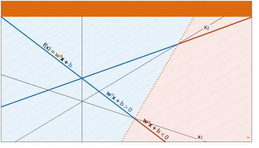
</p>

This is the same kind of linear score used by logistic regression. The difference is not the form of the score. The difference is the training objective:

```text
Logistic regression:
    chooses w and b by minimizing log loss, often with L1 or L2 regularization;
    the score is converted into a probability through a sigmoid.

Linear SVM:
    chooses w and b by maximizing the classification margin;
    the score is a signed margin-like decision value rather than a probability.
```

---

## 5. Why score scaling matters

The same zero decision boundary can be represented by many different score functions. If

$$
f(x)=w^\top x+b,
$$

then for any positive constant $c$,

$$
f_c(x)=c(w^\top x+b)
$$

has the same zero set:

$$
f_c(x)=0 \quad \Longleftrightarrow \quad f(x)=0.
$$

The hard predictions are therefore unchanged. But the numerical scores away from the boundary are different. This scaling freedom matters because SVMs use the score levels $+1$ and $-1$ to define the margin boundaries.

The course explains this visually: the hyperplane can be rotated or rescaled while keeping the same decision boundary in the input plane.

<p align="center">
  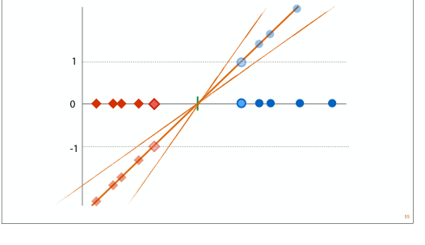
</p>

The SVM uses the scaling freedom in a specific way. It chooses the scale of $w$ and $b$ so that the closest positive support vectors have score $+1$ and the closest negative support vectors have score $-1$.

<p align="center">
  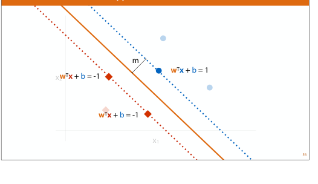
</p>

With this convention, the margin boundaries are

$$
w^\top x+b=+1
$$

and

$$
w^\top x+b=-1.
$$

The decision boundary is halfway between them:

$$
w^\top x+b=0.
$$

This explains why the number $1$ appears in the SVM constraints. It is not an arbitrary classification threshold in probability space. It is a score-scaling convention that makes the margin mathematically well-defined.

---

## 6. Functional margin and geometric margin

For observation $(x_i,y_i)$, the signed score is

$$
y_i f(x_i)=y_i(w^\top x_i+b).
$$

This quantity is positive if the observation is correctly classified and negative if it is misclassified:

```text
positive class, correct:
    y_i=+1 and f(x_i)>0, so y_i f(x_i)>0

negative class, correct:
    y_i=-1 and f(x_i)<0, so y_i f(x_i)>0

incorrect classification:
    y_i and f(x_i) have opposite signs, so y_i f(x_i)<0
```

This signed score is often called the **functional margin**. Under the SVM scaling convention, the hard-margin constraints become

$$
y_i(w^\top x_i+b)\geq 1
\quad\text{for every training observation }i.
$$

This single inequality handles both classes:

- if $y_i=+1$, then $w^\top x_i+b\geq 1$;
- if $y_i=-1$, then $w^\top x_i+b\leq -1$.

<p align="center">
  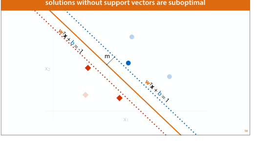
</p>

The functional margin depends on the arbitrary scale of $w$ and $b$. The geometric margin removes that scale by dividing by the length of $w$.

The distance from a point $x_i$ to the hyperplane $w^\top x+b=0$ is

$$
\frac{|w^\top x_i+b|}{\lVert w\rVert_2}.
$$

The signed geometric margin is

$$
\gamma_i = \frac{y_i(w^\top x_i+b)}{\lVert w\rVert_2}.
$$

The classifier margin is the smallest signed geometric margin over the training set:

$$
\gamma = \min_i \frac{y_i(w^\top x_i+b)}{\lVert w\rVert_2}.
$$

The maximum-margin classifier chooses a boundary that makes this smallest distance as large as possible.

---

## 7. Margin width and the role of $\lVert w\rVert$

Under the SVM scaling convention, the positive margin boundary is

$$
w^\top x+b=+1,
$$

and the negative margin boundary is

$$
w^\top x+b=-1.
$$

The distance from the decision boundary $w^\top x+b=0$ to either margin boundary is

$$
\frac{1}{\lVert w\rVert_2}.
$$

Therefore the full width of the margin band between the two support-vector boundaries is

$$
\frac{2}{\lVert w\rVert_2}.
$$

The course gives this exact two-sided margin picture:

<p align="center">
  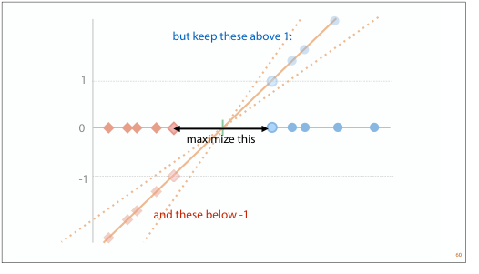
</p>

Because the margin width is $2/\lVert w\rVert_2$, maximizing the margin is equivalent to minimizing $\lVert w\rVert_2$. Since squaring is monotone for nonnegative values, minimizing $\lVert w\rVert_2$ is equivalent to minimizing $\lVert w\rVert_2^2=w^\top w$.

<p align="center">
  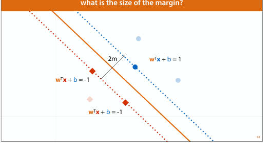
</p>

This gives the usual hard-margin SVM objective:

$$
\min_{w,b}\; \frac{1}{2}w^\top w
$$

subject to

$$
y_i(w^\top x_i+b)\geq 1
\quad\text{for all }i.
$$

The factor $1/2$ does not change the minimizer. It is included because it makes derivatives cleaner:

$$
\nabla_w\left(\frac{1}{2}w^\top w\right)=w.
$$

<p align="center">
  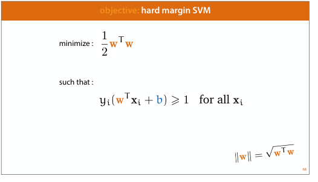
</p>

---

## 8. Hard-margin SVM

The hard-margin SVM assumes that the classes are perfectly linearly separable. It solves

$$
\begin{aligned}
\min_{w,b}\quad & \frac{1}{2}\lVert w\rVert_2^2 \\
\text{subject to}\quad & y_i(w^\top x_i+b)\geq 1,\quad i=1,\ldots,n.
\end{aligned}
$$

This is a constrained convex optimization problem. The objective is convex, and the constraints are linear in $w$ and $b$. Convexity matters because it means the optimization problem has a well-behaved global optimum rather than many unrelated local optima.

The hard-margin formulation is conceptually important, but it is usually too strict for real data. The Telco churn data are not expected to be perfectly separable. Customers with similar contract and usage profiles may still differ in churn outcome because of unobserved factors, random events, measurement noise, or business context not contained in the dataset.

If one awkward observation forces the margin to become very small, the hard-margin solution can become too sensitive to that observation. This is exactly the kind of behaviour regularization is meant to avoid.

---

## 9. Soft-margin SVM

The soft-margin SVM relaxes the hard-margin constraints. Instead of requiring every observation to lie outside the margin on the correct side, it allows violations but penalizes them.

One way to write this is with slack variables $\xi_i\geq 0$:

$$
\begin{aligned}
\min_{w,b,\xi}\quad & \frac{1}{2}\lVert w\rVert_2^2 + C\sum_{i=1}^n \xi_i \\
\text{subject to}\quad & y_i(w^\top x_i+b)\geq 1-\xi_i,\quad i=1,\ldots,n,\\
& \xi_i\geq 0,\quad i=1,\ldots,n.
\end{aligned}
$$

The slack variable $\xi_i$ measures how much observation $i$ violates the margin requirement.

```text
xi_i = 0:
    observation is correctly classified and outside/on the margin.

0 < xi_i <= 1:
    observation is on the correct side of the decision boundary but inside the margin.

xi_i > 1:
    observation is misclassified.
```

The parameter $C$ controls how expensive violations are:

```text
large C:
    violations are expensive;
    the model tries harder to classify training observations correctly;
    margin may become narrower;
    lower bias but higher variance risk.

small C:
    violations are cheaper;
    the model allows a wider margin and more training violations;
    stronger regularization;
    higher bias but lower variance risk.
```

The course emphasizes that as $C$ goes to infinity, margin violations become infinitely bad. In that limit, the soft-margin formulation approaches the hard-margin SVM if the data are separable.

<p align="center">
  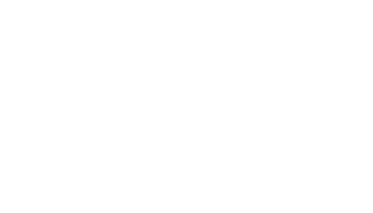
</p>

The soft-margin idea can be visualized in one dimension: some points are on the wrong side of the margin or even the wrong side of the decision boundary, and these points receive a penalty.

<p align="center">
  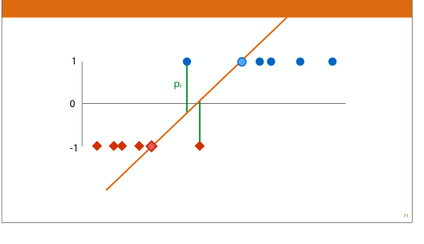
</p>

For churn modelling, soft margins are essential. We should not expect a perfectly clean boundary between churners and non-churners. Instead, we want a classifier that balances margin width against mistakes in a way that generalizes well under training-set cross-validation.

---

## 10. From constrained optimization to hinge loss

The soft-margin SVM can be written as a constrained optimization problem, but there is also an unconstrained loss-function view. The course presents this as a fork in the road: either solve the constrained problem directly, or rewrite the problem as an unconstrained objective that can be optimized with gradient-based methods.

<p align="center">
  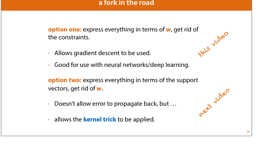
</p>

For a given $w$ and $b$, the smallest slack variable needed for observation $i$ is

$$
\xi_i = \max\{0,1-y_i(w^\top x_i+b)\}.
$$

Substituting this into the soft-margin objective gives the regularized hinge-loss form:

$$
\min_{w,b}\; \frac{1}{2}\lVert w\rVert_2^2
+ C\sum_{i=1}^n \max\{0,1-y_i(w^\top x_i+b)\}.
$$

The per-observation hinge loss is

$$
\ell_i=\max\{0,1-y_i f(x_i)\}.
$$

<p align="center">
  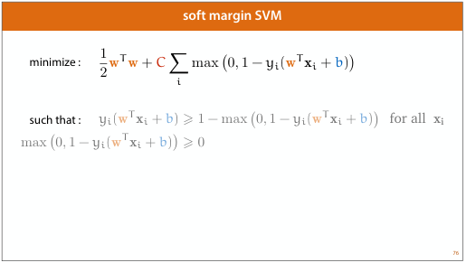
</p>

This loss has three regimes:

```text
y_i f(x_i) >= 1:
    correctly classified with sufficient margin;
    hinge loss is 0.

0 < y_i f(x_i) < 1:
    correctly classified but inside the margin;
    hinge loss is positive.

y_i f(x_i) <= 0:
    misclassified;
    hinge loss is at least 1.
```

This is why the SVM is a margin classifier rather than only an error classifier. It does not merely ask whether the sign of $f(x)$ is correct. It asks whether the score is correct by a comfortable margin.

---

## 11. Hinge loss versus logistic loss and other classification losses

The course places SVM loss alongside other classification losses.

<p align="center">
  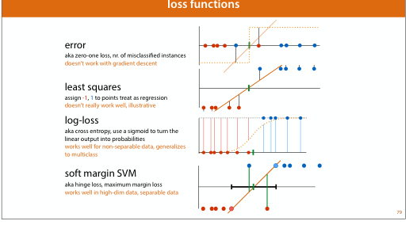
</p>

The main distinction is:

```text
zero-one loss:
    counts classification mistakes directly;
    difficult to optimize with gradient methods.

least-squares classification:
    treats labels as numeric targets, usually -1 and +1;
    useful for illustration but not usually ideal for classification.

logistic loss:
    smooth probabilistic loss;
    keeps penalizing even correctly classified points, although the penalty becomes small.

hinge loss:
    piecewise-linear maximum-margin loss;
    gives zero loss to points that are correctly classified with margin at least 1.
```

For a margin score $m=yf(x)$, the hinge loss is

$$
\ell_{\text{hinge}}(m)=\max\{0,1-m\}.
$$

The logistic loss is

$$
\ell_{\text{logistic}}(m)=\log(1+\exp(-m)).
$$

Both encourage correct classification. But they behave differently far from the boundary. The hinge loss becomes exactly zero once the margin is large enough. Logistic loss remains positive for every finite margin, although it becomes very small for confidently correct observations.

This difference matters for interpretation. Logistic regression is naturally probabilistic. A standard SVM is not. Its primary output is a decision score or signed distance-like quantity, not a calibrated probability.

---

## 12. Feature expansion and why kernels enter naturally

The course connects SVMs to an earlier idea: linear models can become more powerful by adding derived features. For example, an XOR-like pattern cannot be solved by a linear separator in the original two-dimensional space, but it can become linearly separable after adding a cross-product feature.

<p align="center">
  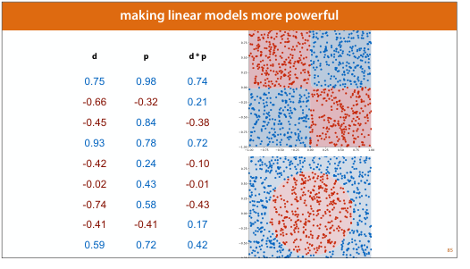
</p>

In general, we can map the original features $x$ into a transformed feature vector $\phi(x)$ and fit a linear model in that transformed space:

$$
f(x)=w^\top \phi(x)+b.
$$

This is still a linear classifier in the transformed feature space, but it can be nonlinear in the original feature space. For example, adding squared terms such as $x_1^2$ and $x_2^2$ can make a circular boundary linear in the expanded feature representation.

The problem is that explicit feature expansion can become very large. If we include all second-order, third-order, fourth-order, or fifth-order interactions, the number of transformed features can grow quickly. That creates memory and runtime problems.

This is where kernels become useful.

---

## 13. The dual view and inner products

The classical SVM solution can be written in a **dual** form. The full derivation uses constrained optimization and Lagrange multipliers, but the important idea for kernels is simple:

> In the dual formulation, the optimization depends on training observations only through inner products between pairs of observations.

In the linear case, the relevant similarity between observations is

$$
x_i^\top x_j.
$$

After fitting, the decision function can be written in terms of support vectors:

$$
f(x)=\sum_{i\in\mathcal{S}} \alpha_i y_i K(x_i,x)+b,
$$

where:

- $\mathcal{S}$ is the set of support vectors;
- $\alpha_i$ are learned dual coefficients;
- $K(x_i,x)$ is a kernel similarity between support vector $x_i$ and new point $x$.

Only support vectors appear in this final expression because non-support-vector observations have zero dual coefficient.

The course shows the dual SVM objective with the kernel function $k(x_i,x_j)$ replacing the ordinary dot product.

<p align="center">
  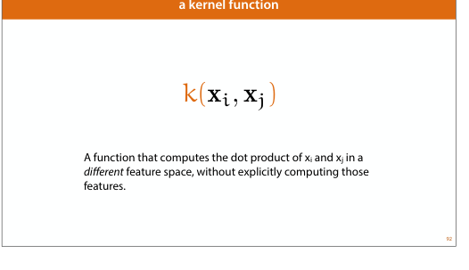
</p>

This is the bridge to the kernel trick.

---

## 14. The kernel trick

Suppose we want to fit a linear SVM in a transformed feature space $\phi(x)$, but we do not want to explicitly construct all transformed features. The inner product in that transformed space is

$$
\phi(x)^\top\phi(z).
$$

A kernel function computes this inner product directly:

$$
K(x,z)=\phi(x)^\top\phi(z).
$$

The kernel trick means: replace every dot product in the dual SVM with a kernel function. Then the model behaves as if it is fitting a linear separator in the expanded feature space, without explicitly building the expanded feature matrix.

<p align="center">
  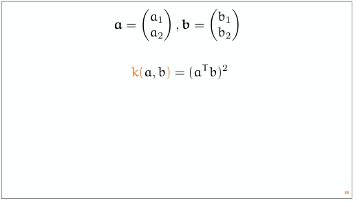
</p>

This is why SVMs are often explained as linear classifiers in high-dimensional feature spaces. The boundary is linear in $\phi(x)$, but can be nonlinear in the original feature variables.

---

## 15. Common kernels

### Linear kernel

The linear kernel is

$$
K(x,z)=x^\top z.
$$

This gives a linear SVM in the original feature space. It is useful when we want to test whether a maximum-margin linear boundary is competitive with logistic regression.

### Polynomial kernel

A polynomial kernel has the form

$$
K(x,z)=(\gamma x^\top z+r)^d,
$$

where $d$ is the polynomial degree, $\gamma$ controls the scale of the inner product, and $r$ is an offset term.

Polynomial kernels represent interaction-like expansions. For tabular data, this can be conceptually related to adding cross-products between features.

### RBF kernel

The radial basis function kernel is

$$
K(x,z)=\exp(-\gamma\lVert x-z\rVert_2^2).
$$

Some sources write the exponent without the square, but the scikit-learn RBF kernel uses the squared Euclidean distance. The RBF kernel measures local similarity: two observations have high kernel value if they are close in feature space and low kernel value if they are far apart.

<p align="center">
  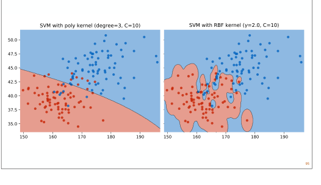
</p>

The parameter $\gamma$ controls how local the influence of each observation is:

```text
small gamma:
    similarity decays slowly with distance;
    smoother decision boundary;
    higher bias, lower variance.

large gamma:
    similarity decays quickly with distance;
    very local influence;
    more flexible boundary;
    lower bias, higher overfitting risk.
```

The RBF kernel is powerful because it corresponds to a very rich transformed feature space. That power is also the danger. A large $C$ together with a large $\gamma$ can produce a boundary that follows training-set details too closely.

---

## 16. The practical SVM recipe

The course gives a compact practical recipe for kernel SVMs:

<p align="center">
  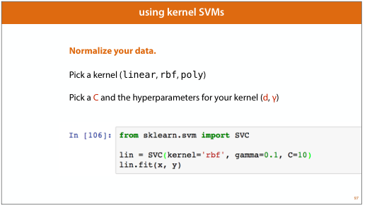
</p>

For this project, that recipe becomes:

```text
1. Use the training set only.
2. Put preprocessing inside the cross-validation pipeline.
3. Scale numeric features.
4. One-hot encode categorical features for ordinary scikit-learn SVMs.
5. Try a small transparent grid over C and, for RBF, gamma.
6. Evaluate with PR-AUC as the primary development metric.
7. Use ROC-AUC, balanced accuracy, precision, recall, specificity, and F1 as diagnostics.
8. Do not use the held-out test set.
```

The scaling step is essential. SVMs are not scale-invariant. A feature measured in large units can dominate distances, margins, and RBF similarities. This connects directly to the preprocessing material on normalization and standardization: distance-based and geometry-based models need features on comparable scales.

---

## 17. LinearSVC versus SVC in scikit-learn

The scikit-learn SVM ecosystem has several related estimators. For this project, the most relevant are `LinearSVC` and `SVC`.

### LinearSVC

`LinearSVC` is designed for linear SVMs. It is usually much faster than `SVC(kernel="linear")` on larger or high-dimensional datasets because it uses a linear-SVM solver rather than the full kernel machinery.

Important practical points:

```text
LinearSVC:
    efficient for linear maximum-margin classification;
    suitable for high-dimensional one-hot encoded data;
    exposes decision_function scores;
    does not expose support vectors in the same way as SVC;
    uses squared hinge loss by default in scikit-learn.
```

The default squared hinge loss is

$$
\ell_{\text{squared hinge}}(y,f(x))=\max\{0,1-yf(x)\}^2.
$$

This penalizes large margin violations more strongly than ordinary hinge loss. The conceptual maximum-margin idea remains the same, but the exact objective differs.

### SVC

`SVC` is the kernel-capable support vector classifier. It can use kernels such as `linear`, `poly`, and `rbf`.

Important practical points:

```text
SVC:
    supports kernel SVMs;
    exposes support vectors;
    can use RBF and polynomial kernels;
    is usually more expensive than LinearSVC;
    training cost can become high because kernel methods involve pairwise similarities.
```

For the Telco dataset, `SVC(kernel="rbf")` is a natural nonlinear candidate, but it should be evaluated with a modest grid first because runtime can grow quickly.

---

## 18. Probability estimates and calibration

A standard SVM produces a decision score, not a probability.

For scikit-learn SVMs, `decision_function` returns a signed score. This score is suitable for ranking metrics:

```text
ROC-AUC:
    needs a ranking score, not necessarily a probability.

PR-AUC / average precision:
    also needs a ranking score, not necessarily a probability.
```

This is important for our project because PR-AUC is the primary development metric. We can evaluate SVMs using decision scores without forcing probability calibration in the first SVM notebook.

`SVC(probability=True)` can produce probability estimates, but this adds an extra calibration-like procedure internally and can substantially increase runtime. It can also make probability behaviour less transparent, because the fitted probabilities are not simply the raw SVM margins.

For the current SVM model-family section, the cleaner approach is:

```text
Use decision_function for ranking metrics and curve diagnostics.
Treat probability calibration as a later modelling decision if an SVM becomes a serious final candidate.
```

This is consistent with the rest of the project: calibration and final threshold selection are not part of the exploratory model-family comparison yet.

---

## 19. Class imbalance and class weighting

The Telco churn target is imbalanced: churners are the minority class. As in earlier sections, accuracy alone is not enough. We care about ranking quality, minority-class recall, precision, specificity, and threshold-dependent tradeoffs.

SVMs can incorporate class imbalance through class weights. In scikit-learn, `class_weight="balanced"` increases the effective penalty for mistakes on the minority class and decreases the relative penalty for mistakes on the majority class. Conceptually, this changes the objective from a uniform penalty

$$
C\sum_i \xi_i
$$

to class-dependent penalties such as

$$
\sum_i C_{y_i}\xi_i.
$$

This can move the boundary toward the majority class and make the classifier more willing to identify minority-class observations.

Expected tradeoff:

```text
class weighting may increase recall;
class weighting may reduce precision;
class weighting may reduce specificity;
class weighting should be evaluated through training-only cross-validation.
```

Class weighting is not automatically better. It is another modelling choice that should be judged by the same development metrics used elsewhere in the project.

---

## 20. SVMs versus earlier model families

SVMs should be interpreted relative to the models already studied.

### Logistic regression

Both logistic regression and linear SVMs use linear scores. The difference is the loss:

```text
logistic regression:
    smooth probabilistic log loss;
    direct probability interpretation;
    coefficients have a log-odds interpretation.

linear SVM:
    margin-based hinge or squared-hinge loss;
    direct score is not a probability;
    emphasizes points near or inside the margin.
```

### kNN

Both kNN and RBF SVMs are geometric. kNN classifies based on nearby training observations directly. RBF SVMs use kernel similarities to support vectors. Both are sensitive to scaling.

### Decision trees and ensembles

Trees partition the feature space with axis-aligned splits. Random forests and boosting combine many such partitions. RBF SVMs create smooth nonlinear boundaries based on similarity in the scaled feature space. They are a different form of nonlinearity.

### Boosting

Boosted trees are strong tabular-data models and often perform very well on structured datasets. SVMs are still worth studying because they provide a different modelling principle: maximum-margin classification. Even if an SVM is not the final best model, it is important as a classical machine learning model family and as a reference point for margin-based thinking.

---

## 21. Suggested SVM notebook design for the Telco project

The SVM notebook should be a development-stage model-family section, not final model selection. A good first design would include:

```text
Candidate families:
    LinearSVC without class weights;
    LinearSVC with class_weight="balanced";
    SVC with linear kernel if runtime is acceptable;
    SVC with RBF kernel;
    SVC with RBF kernel and class_weight="balanced" if runtime is acceptable.

Primary metric:
    PR-AUC / average precision, computed from decision_function scores.

Diagnostics:
    ROC-AUC;
    balanced accuracy;
    precision;
    recall;
    specificity;
    F1;
    confusion matrices;
    ROC curve;
    precision-recall curve;
    threshold-like score tradeoffs.
```

For a transparent educational grid, we can start with logarithmic values such as:

```text
C values:
    0.01, 0.1, 1, 10

gamma values for RBF:
    "scale", 0.01, 0.1, 1
```

The exact grid should be chosen after checking runtime. RBF SVMs can be substantially slower than logistic regression, trees, random forests, and boosting because kernel methods depend on pairwise similarities between training observations.

The notebook should compare the selected SVM candidates against reference models already developed:

```text
selected L2 logistic regression;
selected kNN;
selected single decision tree;
selected bagged trees;
selected random forest;
selected XGBoost or top boosting representative.
```

Interpretation should remain cautious. If SVM results are close to logistic regression or boosting, small differences should be treated as development-stage evidence, not proof of statistical superiority.

---

## 22. Thresholds, decision scores, and reporting language

For probabilistic models, threshold diagnostics are usually shown over probability thresholds such as 0.1, 0.2, 0.3, and so on. For SVMs, the natural output is a decision score. The default hard decision boundary is score zero:

$$
\widehat{y}=+1\quad\text{if}\quad f(x)\geq 0.
$$

But threshold diagnostics can still be built by varying the score threshold:

$$
\widehat{y}=+1\quad\text{if}\quad f(x)\geq t.
$$

This creates precision-recall-specificity tradeoffs just like probability thresholds, but the threshold values are margin-score values rather than probabilities. That distinction should be stated clearly in the notebook and report.

A safe reporting phrase is:

```text
The SVM threshold analysis varies the decision-function score threshold, not a calibrated churn-probability threshold. These diagnostics show the operating tradeoff implied by the SVM ranking score. Probability calibration is deferred to later model-selection work if an SVM remains a serious final candidate.
```

---

## 23. Summary

Support vector machines provide a maximum-margin view of classification. The starting question is not simply whether a boundary separates the training data, but whether it separates the classes with the largest possible empty margin around the decision boundary.

The key mathematical ideas are:

$$
f(x)=w^\top x+b,
$$

$$
y_i(w^\top x_i+b)\geq 1,
$$

$$
\text{margin width}=\frac{2}{\lVert w\rVert_2},
$$

$$
\min_{w,b}\frac{1}{2}\lVert w\rVert_2^2
\quad\text{subject to}\quad
 y_i(w^\top x_i+b)\geq 1,
$$

and the soft-margin / hinge-loss form

$$
\min_{w,b}\;\frac{1}{2}\lVert w\rVert_2^2
+ C\sum_i \max\{0,1-y_i(w^\top x_i+b)\}.
$$

The kernel trick extends this idea by fitting a linear maximum-margin separator in an implicit transformed feature space:

$$
K(x,z)=\phi(x)^\top\phi(z).
$$

For the Telco project, the practical implications are:

```text
scale features carefully;
fit preprocessing inside cross-validation pipelines;
use decision_function scores for PR-AUC and ROC-AUC;
start with transparent fixed grids over C and gamma;
consider class_weight="balanced" as a training-only modelling choice;
do not treat SVM scores as calibrated probabilities;
do not use the held-out test set during this model-family section.
```

SVMs will give the project a margin-based comparison point against logistic regression, kNN, tree ensembles, and boosting. Whether they become competitive or not, they add an important conceptual lens: classification as the search for a stable boundary with maximum geometric separation from the most critical training points.

---

## References and implementation notes

- Course material: *Beyond Linear Models*, maximum margin loss and support vector machines sections.
- scikit-learn SVM documentation: `sklearn.svm.SVC`, `sklearn.svm.LinearSVC`, kernel functions, class weights, and `decision_function` behaviour.
- scikit-learn model-selection discipline remains the same as in previous notebooks: preprocessing and hyperparameter selection should be inside training-only cross-validation, with the held-out test set untouched until the final locked evaluation.
